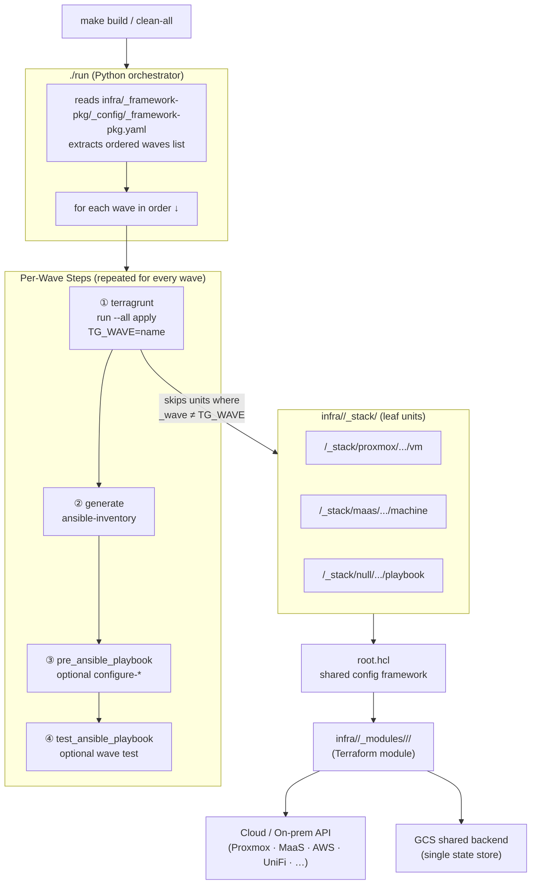
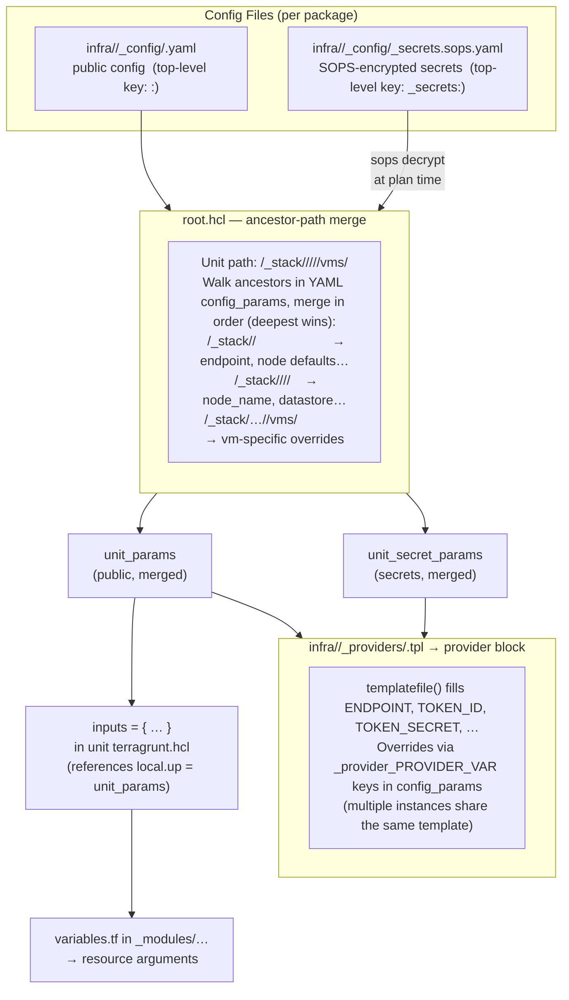
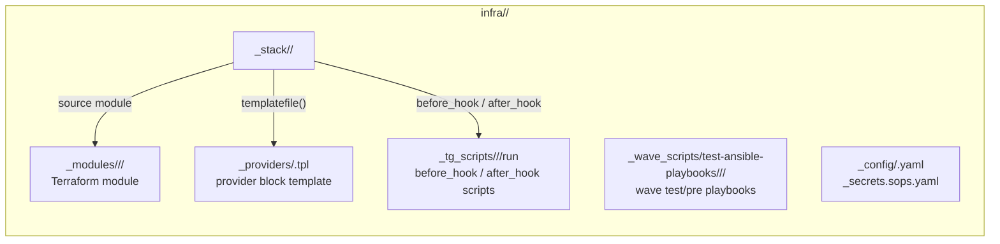
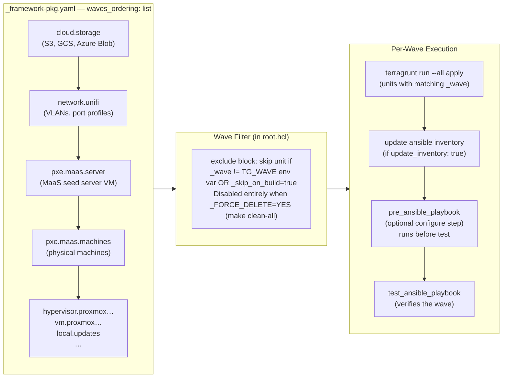
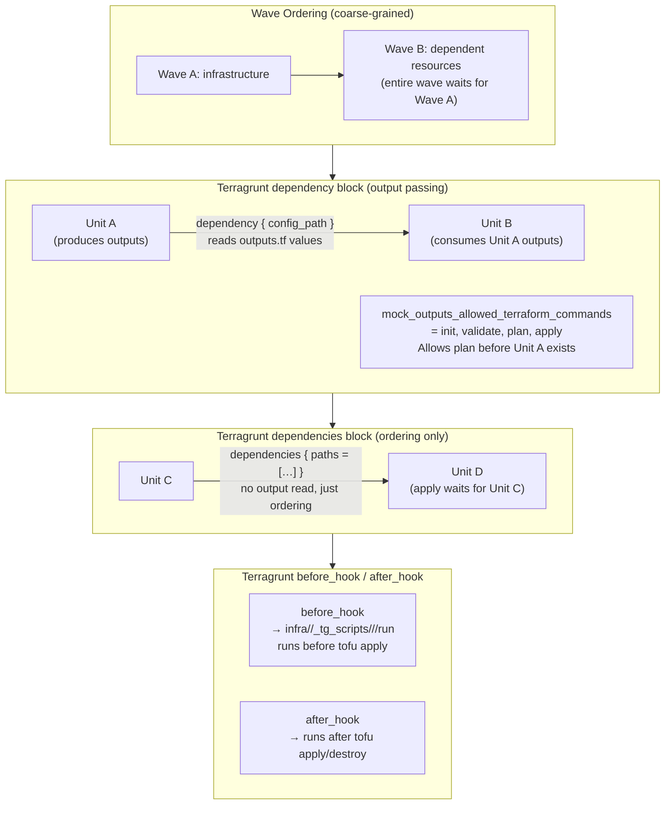
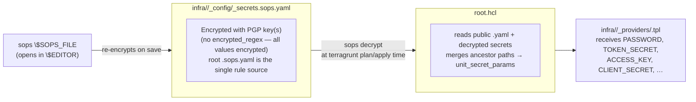

# Framework Architecture

Describes the framework itself — how the pieces fit together — not what resources it manages.

---

## Execution Pipeline

`make build` → Python orchestrator → ordered waves → per-wave Terragrunt + Ansible steps.



**Logs:** every run writes to `~/.run-waves-logs/<timestamp>/` — `run.log` (full) and per-wave `wave-<name>-{apply,test,precheck}.log`.

---

## Config Resolution (YAML → Unit)

Every unit inherits config from its ancestor paths in the YAML, deepest path wins.



**Key rule:** Never hard-code values that exist in the YAML. All per-unit values come from `local.up = include.root.locals.unit_params` using `try(local.up.<key>, <safe-default>)`.

---

## Package System

All infrastructure is organized into self-contained packages under `infra/<pkg>/`. Each package owns its modules, provider templates, scripts, config, and stack units.



**A unit's package does not have to own the provider or module it uses.** `root.hcl` resolves both via the same 3-tier lookup, falling through to the canonical provider package automatically. Units in one package routinely use provider templates and modules owned by another package, with no explicit configuration needed.

**Provider template lookup (3-tier, automatic):**
1. `infra/<p_package>/_providers/<provider>.tpl` — unit's own package
2. `infra/<provider>-pkg/_providers/<provider>.tpl` — canonical provider package
3. `infra/_framework-pkg/_providers/<provider>.tpl` — last resort (null only)

**Module lookup (3-tier, automatic):**
1. `infra/<p_package>/_modules/` — unit's own package (detected via `.modules-root` sentinel)
2. `infra/<provider>-pkg/_modules/` — canonical provider package
3. `infra/_framework-pkg/_modules/`

**Explicit override** (when the automatic lookup isn't right):
```yaml
# in config_params for the unit or subtree:
_modules_dir: <other-pkg>/_modules    # relative to infra/
_tg_scripts_dir: <other-pkg>/_tg_scripts
_wave_scripts_dir: <other-pkg>/_wave_scripts
```

**`p_package`** is derived by `root.hcl` from the unit's path (`infra/<pkg>/_stack/…`). It defaults to `"_framework-pkg"`.

---

## Wave System

Waves define an ordered build DAG. Each wave name is a value of `_wave:` in `config_params`.



**Destroy** runs waves in **reverse order** (`./run --clean`), so dependencies are torn down before their dependents.

---

## Dependency Model

Three distinct mechanisms, each for a different scope.



---

## Directory Layout

```
pwy-home-lab/                       # repo root = stack root
├── root.hcl                        # Shared config: YAML merge, provider template, backend, wave filter
├── run                             # Python orchestrator: waves, apply, inventory, test hooks
├── set_env.sh                      # Exports path vars; source before any terragrunt command
├── Makefile                        # Thin wrapper: build / clean / clean-all / test
│
├── infra/                          # All packages — each is self-contained
│   ├── <pkg>/
│   │   ├── _stack/<provider>/<path>/<unit>/   ← one leaf dir = one unit = one terragrunt.hcl
│   │   ├── _modules/<provider>/<module>/      ← Terraform modules for this package
│   │   ├── _providers/<provider>.tpl          ← provider { } block templates
│   │   ├── _tg_scripts/<role>/<name>/run      ← called by Terragrunt before/after hooks
│   │   ├── _wave_scripts/test-ansible-playbooks/<role>/<name>/  ← wave test/pre playbooks
│   │   ├── _config/<pkg>.yaml                 ← public config  (top-level key: <pkg>:)
│   │   ├── _config/<pkg>_secrets.sops.yaml    ← SOPS secrets  (top-level key: <pkg>_secrets:)
│   │   └── _setup/run                         ← OS-level tool installation
│   │
│   ├── <stack-pkg>/                # Stack units (uses provider templates + modules from other pkgs)
│   ├── <provider>-pkg/             # Provider template + matching Terraform modules
│   ├── <service>-pkg/              # Service-specific VM + configure/update scripts
│   └── _framework-pkg/                # Fallback package: null provider templates + shared modules; setup tooling
│
├── framework/
│   ├── generate-ansible-inventory/ # Reads GCS state → writes dynamic inventory + SSH config
│   ├── clean-all/                  # nuclear destroy: pre-purge Proxmox VMs + wipe GCS state
│   └── lib/
│       └── merge-stack-config.py   # Merges all <pkg>.yaml files into a single resolved config
│
├── scripts/
│   └── ai-only-scripts/            # AI-generated diagnostic / one-off operational scripts
│
├── utilities/
│   └── bash/
│       ├── init.sh
│       ├── framework-utils.sh      # confirm_destructive, wait_for_condition, _find_component_config
│       └── python-utils.sh
│
└── docs/
    ├── ai-log/                     # Timestamped session logs (written before each commit)
    ├── ai-log-summary/             # Compacted log: current-state facts and key decisions
    └── framework/                  # Architecture docs (this file)
```

---

## SOPS + Secrets Flow



**Never use `Write`, `Edit`, shell redirect (`>`), or `tee` on `.sops.yaml` files.**

```bash
# Single key update:
sops --set '["<pkg>_secrets"]["providers"]["<p>"]["config_params"]["<path>"]["<key>"] "<val>"' "$SOPS_FILE"

# Interactive full-file edit:
sops "$SOPS_FILE"

# Create from scratch:
cat > /tmp/new.yaml << 'EOF'
<pkg>_secrets:
  key: value
EOF
EDITOR="cp /tmp/new.yaml" sops "$SOPS_FILE"   # uses target path for rule matching
rm /tmp/new.yaml
```
